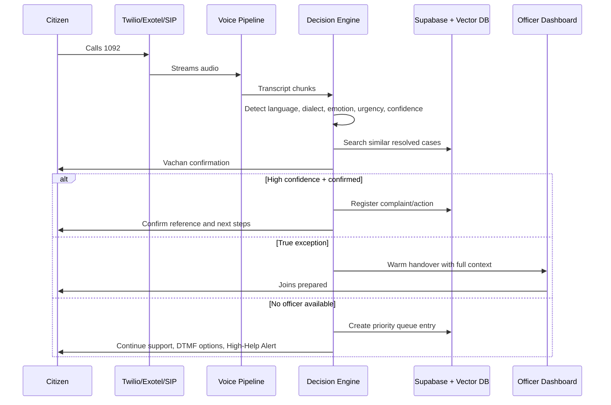
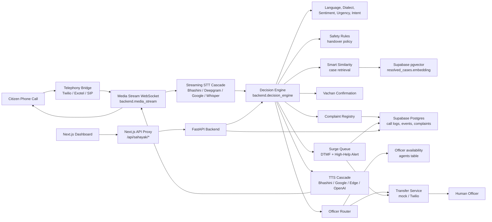
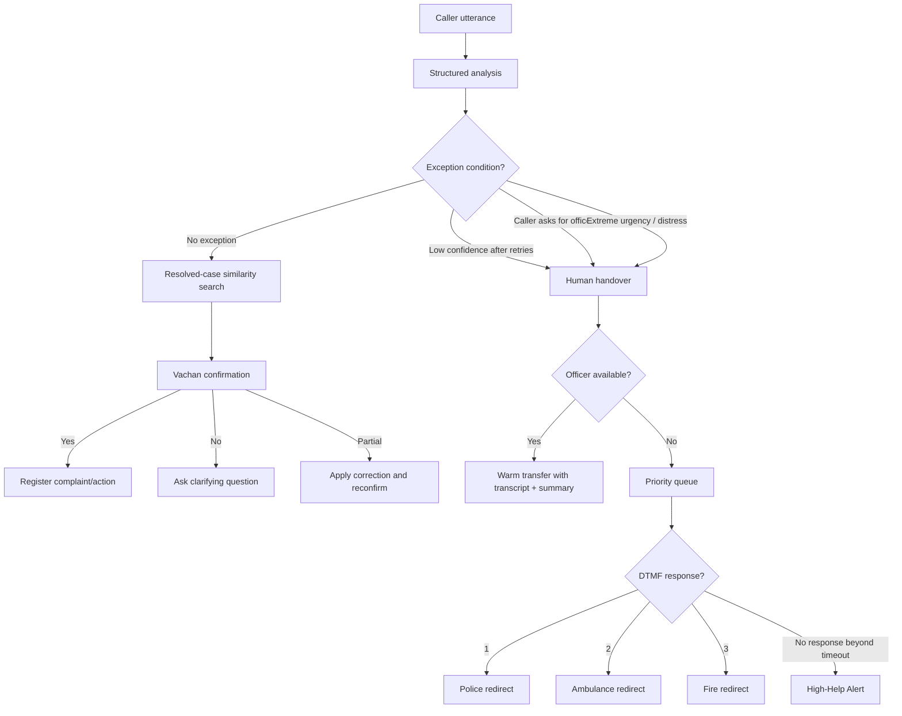
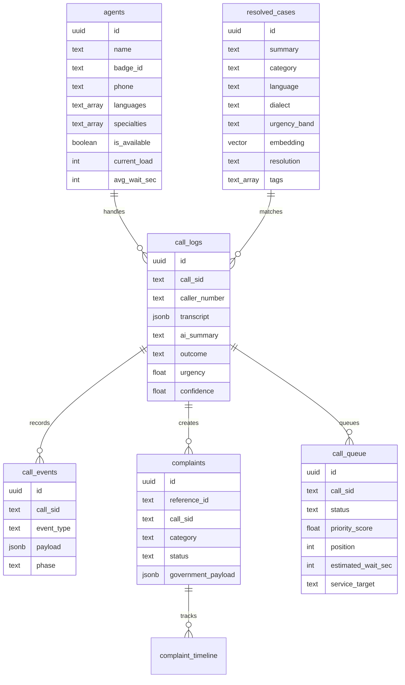
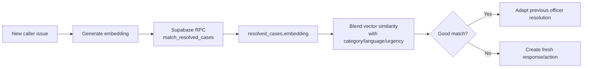

# Sahayak 1092

**Every Voice Heard. Every Call Resolved. Every Second Counts.**

Sahayak 1092 is an AI-first voice-to-voice helpline platform for the 1092 emergency support flow. It answers immediately, understands the caller's language and situation, resolves routine high-confidence calls end-to-end, and transfers only true exception cases to the best available officer with full context.

The system is built for Indian public-service conditions: multilingual callers, dialect variation, emotional speech, high-volume surges, limited officer capacity, and the need for auditable decisions.

## Contents

- [Why This Exists](#why-this-exists)
- [What Sahayak Does](#what-sahayak-does)
- [Core Call Flow](#core-call-flow)
- [Architecture](#architecture)
- [Repository Structure](#repository-structure)
- [Tech Stack](#tech-stack)
- [Quick Start](#quick-start)
- [Environment Setup](#environment-setup)
- [Supabase and Vector DB](#supabase-and-vector-db)
- [Run the App](#run-the-app)
- [Testing](#testing)
- [Live Twilio Call Setup](#live-twilio-call-setup)
- [Dashboard](#dashboard)
- [API Reference](#api-reference)
- [Production Deployment](#production-deployment)
- [Demo Script](#demo-script)
- [Security Notes](#security-notes)

## Why This Exists

When a citizen calls 1092, they need help quickly. In many current helpline flows, almost every call reaches a human officer directly, even if the issue is routine or already handled many times before. That creates four problems:

- Long waits during stressful or urgent moments.
- Repeated explanations from citizens.
- Language, dialect, and emotion mismatch between caller and officer.
- Officer overload from repetitive cases.

Sahayak changes the default operating model from **human-first** to **AI-first with human safety rails**.

The goal is not to replace officers. The goal is to protect their attention for cases where human judgement matters most.

## What Sahayak Does

| Capability | Description |
|---|---|
| Instant AI call ownership | Sahayak answers from the first second instead of waiting for a human queue. |
| Multilingual understanding | Detects and handles Kannada, Hindi, English, and dialect signals through a provider cascade and deterministic fallbacks. |
| Emotion and urgency analysis | Classifies sentiment, distress, urgency, category, intent, and confidence. |
| Smart Similarity Detection | Matches new calls with previously resolved officer-handled cases using embeddings and vector search. |
| Vachan confirmation loop | Restates the understood issue and asks for yes/no/partial confirmation before action. |
| Autonomous complaint registration | Creates structured complaint/action records for high-confidence confirmed calls. |
| Human exception handover | Transfers low-confidence, human-requested, or extreme-distress calls to officers. |
| Urgency-first routing | Scores officers by urgency priority, language/dialect fit, and wait/load signals. |
| Warm transfer | Sends transcript, AI summary, sentiment, urgency, and one-click correction context to the officer. |
| Surge queue | Queues callers when officers are unavailable, keeps priority order, and shows estimated wait. |
| DTMF emergency redirect | Lets waiting callers press 1 for Police, 2 for Ambulance, 3 for Fire Services. |
| High-Help Alert | If a queued caller becomes unresponsive beyond the configured timeout, Sahayak escalates toward police assistance. |
| Officer dashboard | Next.js command center for live calls, handovers, queue, complaints, and resolved-case learning. |
| Auditability | Stores call events, decisions, transcripts, corrections, queue events, and complaint timelines. |

## Core Call Flow



## Architecture

Sahayak is split into telephony, voice, intelligence, decisioning, routing, persistence, security, and dashboard layers. This keeps the project easy to run locally while still matching a production deployment shape.



### Decision Architecture

Sahayak uses a rule-based plus ML/LLM hybrid design. Safety decisions are not left only to a generative model.



### Data Architecture



## Repository Structure

```text
.
|-- backend/
|   |-- app.py                       # ASGI entrypoint: backend.app:app
|   |-- main.py                      # FastAPI app, webhooks, REST API
|   |-- config.py                    # Typed environment settings
|   |-- security.py                  # API auth, rate limit, request IDs, Twilio validation
|   |-- decision_engine.py           # AI-first call decision pipeline
|   |-- media_stream.py              # Twilio WebSocket voice loop
|   |-- vector_admin.py              # Seed/backfill vector cases
|   |-- intelligence/
|   |   |-- analyzer.py              # Deterministic and LLM analysis
|   |   |-- embeddings.py            # Deterministic/OpenAI-compatible embeddings
|   |   |-- safety_rules.py          # Handover and safety policy
|   |   |-- schemas.py               # Shared domain models
|   |   `-- similarity.py            # Smart Similarity retrieval
|   |-- persistence/
|   |   |-- complaints.py            # Complaint registry and timeline
|   |   |-- models.sql               # Supabase schema and pgvector RPC
|   |   |-- pii.py                   # PII masking helpers
|   |   `-- repository.py            # Call state, logs, events, Redis/local fallback
|   |-- routing/
|   |   |-- officer_router.py        # Urgency/language/wait scoring
|   |   |-- queue_manager.py         # Priority queue and High-Help Alert
|   |   `-- transfer_service.py      # Mock/Twilio warm transfer
|   `-- voice/
|       |-- audio_codec.py           # mu-law/PCM helpers
|       |-- stt.py                   # STT provider cascade
|       |-- tts.py                   # TTS provider cascade and phrase cache
|       `-- vad.py                   # Voice activity detection
|-- dashboard/
|   |-- app/                         # Next.js dashboard
|   |-- app/api/sahayak/[...path]/   # Server-side proxy to backend
|   |-- package.json                 # Dashboard scripts and dependencies
|   `-- app.py                       # Legacy Streamlit fallback
|-- tests/                           # Regression test suite
|-- Makefile                         # Developer commands
|-- ROADMAP.md                       # Phase-wise implementation roadmap
|-- requirements.txt                 # Python dependencies
|-- pyproject.toml                   # pytest/ruff config
`-- .env.example                     # Safe environment template
```

## Tech Stack

| Layer | Technology |
|---|---|
| Backend API | FastAPI, Uvicorn |
| Voice stream | Twilio Media Streams WebSocket |
| Telephony | Twilio today, designed for Exotel/SIP adapter support |
| STT | Bhashini, Deepgram, Google/Gemini/OpenAI fallback paths |
| TTS | Bhashini, Google/gTTS, Edge TTS, OpenAI fallback paths |
| LLM analysis | OpenAI-compatible client, Gemini-compatible base URL support, deterministic fallback |
| Embeddings | OpenAI-compatible embeddings or deterministic local embeddings |
| Database | Supabase Postgres |
| Vector DB | Supabase pgvector |
| Live state | Redis optional, local in-memory fallback |
| Dashboard | Next.js, React, TypeScript |
| Testing | pytest, ruff, Next typecheck/build |

## Quick Start

This path runs the project locally without paid provider keys. It uses deterministic AI fallbacks and local storage where possible.

### 1. Clone and enter the project

```bash
git clone <your-repo-url>
cd Sahayak-1092
```

### 2. Create Python environment

```bash
python -m venv .venv
source .venv/bin/activate
.venv/bin/python -m pip install --prefer-binary -r requirements.txt
```

On Windows PowerShell:

```powershell
python -m venv .venv
.venv\Scripts\Activate.ps1
.venv\Scripts\python -m pip install --prefer-binary -r requirements.txt
```

### 3. Create backend env file

```bash
cp .env.example .env
```

For a local text-only demo, keep these values:

```env
SAHAYAK_ENV=development
DEBUG=true
DEMO_MODE=true
BASE_URL=http://localhost:8000
ANALYSIS_PROVIDER=deterministic
EMBEDDING_PROVIDER=deterministic
TRANSFER_MODE=mock
DASHBOARD_AUTH_REQUIRED=false
VALIDATE_TWILIO_SIGNATURES=false
```

### 4. Create dashboard env file

Create `dashboard/.env.local`:

```env
SAHAYAK_API_URL=http://localhost:8000
NEXT_PUBLIC_SAHAYAK_API_URL=http://localhost:8000
SAHAYAK_DASHBOARD_API_KEY=
```

### 5. Install dashboard dependencies

```bash
make install-dashboard
```

### 6. Start backend

```bash
make PYTHON=.venv/bin/python dev-backend
```

Backend URLs:

```text
API:    http://localhost:8000
Health: http://localhost:8000/health
Docs:   http://localhost:8000/docs
```

### 7. Start dashboard

Open a second terminal:

```bash
make dev-dashboard
```

Dashboard URL:

```text
http://localhost:3000
```

### 8. Run a text-only pipeline call

```bash
curl -X POST http://localhost:8000/api/test-pipeline \
  -H "Content-Type: application/json" \
  -d '{"call_sid":"demo-mobile-1","text":"My mobile phone was stolen at Majestic bus stand","language":"english"}'
```

Then confirm the Vachan loop:

```bash
curl -X POST http://localhost:8000/api/test-pipeline \
  -H "Content-Type: application/json" \
  -d '{"call_sid":"demo-mobile-1","text":"yes","language":"english"}'
```

Check the result in the dashboard, or call:

```bash
curl http://localhost:8000/api/complaints
curl "http://localhost:8000/api/call-events?call_sid=demo-mobile-1&limit=50"
```

## Environment Setup

Never commit `.env`, `dashboard/.env.local`, or real keys. They are ignored by git.

### Backend `.env`

Use `.env.example` as the source of truth. The most important groups are:

#### App Runtime

```env
SAHAYAK_ENV=development
DEBUG=true
DEMO_MODE=true
HOST=0.0.0.0
PORT=8000
BASE_URL=http://localhost:8000
CORS_ORIGINS=*
```

`BASE_URL` must be public when Twilio is calling your backend. For local phone testing, this is usually an ngrok URL.

#### Dashboard Connection

```env
SAHAYAK_API_URL=http://localhost:8000
NEXT_PUBLIC_SAHAYAK_API_URL=http://localhost:8000
SAHAYAK_DASHBOARD_API_KEY=
```

For the Next.js dashboard, the main production variable is `SAHAYAK_DASHBOARD_API_KEY`, used by the server-side proxy.

#### Telephony

```env
TWILIO_ACCOUNT_SID=
TWILIO_AUTH_TOKEN=
TWILIO_PHONE_NUMBER=
TRANSFER_MODE=mock
```

Use `TRANSFER_MODE=mock` for local demos. Use `TRANSFER_MODE=twilio` for real warm transfer testing.

#### AI and Voice Providers

```env
OPENAI_API_KEY=
OPENAI_BASE_URL=
LLM_MODEL=gpt-4o
ANALYSIS_PROVIDER=auto

BHASHINI_API_KEY=
BHASHINI_USER_ID=
BHASHINI_PIPELINE_URL=https://dhruva-api.bhashini.gov.in/services/inference

DEEPGRAM_API_KEY=
GEMINI_API_KEY=
STT_PROVIDER_ORDER=bhashini,deepgram,google,openai_whisper
TTS_PROVIDER_ORDER=bhashini,google,edge,openai
VOICE_PROVIDER_TIMEOUT_SEC=12
TTS_PHRASE_CACHE_ENABLED=true
```

If you use Gemini through an OpenAI-compatible endpoint, set:

```env
OPENAI_API_KEY=your_gemini_key
OPENAI_BASE_URL=https://generativelanguage.googleapis.com/v1beta/openai/
LLM_MODEL=gemini-1.5-flash
```

#### Persistence and Vector Search

```env
SUPABASE_URL=
SUPABASE_KEY=
REDIS_URL=

EMBEDDING_PROVIDER=deterministic
EMBEDDING_MODEL=text-embedding-3-small
EMBEDDING_DIMENSION=1536
VECTOR_SEARCH_LIMIT=10
VECTOR_DB_MATCH_THRESHOLD=0.15
SIMILARITY_MATCH_THRESHOLD=0.7
```

For production vector search, use provider-backed embeddings:

```env
EMBEDDING_PROVIDER=openai
OPENAI_API_KEY=your_embedding_provider_key
EMBEDDING_MODEL=text-embedding-3-small
EMBEDDING_DIMENSION=1536
```

#### Security

```env
VALIDATE_TWILIO_SIGNATURES=false
DASHBOARD_AUTH_REQUIRED=false
DASHBOARD_API_KEY=
DASHBOARD_ADMIN_KEY=
DASHBOARD_READONLY_KEY=
RATE_LIMIT_ENABLED=true
RATE_LIMIT_PER_MINUTE=180
MUTATION_RATE_LIMIT_PER_MINUTE=60
REQUEST_ID_HEADER=X-Request-ID
MASK_PII_IN_LOGS=true
DATA_RETENTION_DAYS=180
```

For production:

```env
DEMO_MODE=false
DEBUG=false
VALIDATE_TWILIO_SIGNATURES=true
DASHBOARD_AUTH_REQUIRED=true
DASHBOARD_API_KEY=generate-a-long-random-secret
```

### Dashboard `dashboard/.env.local`

Create this file for local dashboard development:

```env
SAHAYAK_API_URL=http://localhost:8000
NEXT_PUBLIC_SAHAYAK_API_URL=http://localhost:8000
SAHAYAK_DASHBOARD_API_KEY=
```

When backend auth is enabled, set:

```env
SAHAYAK_DASHBOARD_API_KEY=same-value-as-backend-DASHBOARD_API_KEY
```

## Supabase and Vector DB

Supabase is the durable system of record. The vector database is Supabase Postgres with the `pgvector` extension.

Local development can run without Supabase because the backend has local fallback storage. For a realistic demo or production deployment, configure Supabase.

### What Supabase Stores

| Table | Purpose |
|---|---|
| `agents` | Officer profile, languages, specialties, availability, wait/load |
| `resolved_cases` | Human-resolved case knowledge base with embeddings |
| `call_logs` | Call-level summary, transcript, outcome, similarity, queue/handover state |
| `call_events` | Immutable event/audit log for decisions and actions |
| `complaints` | Structured complaint/action records |
| `complaint_timeline` | Timeline for each complaint reference |
| `call_queue` | Priority queue, DTMF redirect, and High-Help Alert data |

### Create the Schema

1. Create a Supabase project.
2. Open Supabase SQL Editor.
3. Run the full SQL in:

```text
backend/persistence/models.sql
```

4. Add credentials:

```env
SUPABASE_URL=https://your-project.supabase.co
SUPABASE_KEY=your-supabase-key
```

5. Seed demo resolved cases:

```bash
make PYTHON=.venv/bin/python seed-vector-cases
```

6. Backfill embeddings:

```bash
make PYTHON=.venv/bin/python backfill-vector-embeddings
```

### How Smart Similarity Uses Vector DB



The implementation lives in:

- `backend/intelligence/embeddings.py`
- `backend/intelligence/similarity.py`
- `backend/persistence/models.sql`
- `backend/vector_admin.py`

## Run the App

### Backend

```bash
make PYTHON=.venv/bin/python dev-backend
```

Direct command:

```bash
.venv/bin/python -m uvicorn backend.app:app --host 0.0.0.0 --port 8000 --reload
```

### Next.js Dashboard

```bash
make dev-dashboard
```

Direct command:

```bash
npm --prefix dashboard run dev -- --hostname 127.0.0.1 --port 3000
```

### Legacy Streamlit Dashboard

The old Streamlit dashboard remains as a fallback:

```bash
make PYTHON=.venv/bin/python dev-dashboard-legacy
```

## Testing

Run the smoke suite:

```bash
make PYTHON=.venv/bin/python smoke
```

Run lint/type checks:

```bash
.venv/bin/python -m ruff check backend dashboard tests
npm --prefix dashboard run typecheck
```

Run the dashboard production build:

```bash
npm --prefix dashboard run build
```

Run a dependency audit for dashboard production dependencies:

```bash
npm --prefix dashboard audit --omit=dev
```

Current verified project status:

```text
Python tests: 48 passed
Ruff: passed
Next.js typecheck: passed
Next.js build: passed
Dashboard npm audit: 0 vulnerabilities
```

## Live Twilio Call Setup

Use this only after the text-only pipeline works.

### 1. Start backend

```bash
make PYTHON=.venv/bin/python dev-backend
```

### 2. Start a public tunnel

```bash
ngrok http 8000
```

### 3. Update backend `.env`

```env
BASE_URL=https://your-ngrok-domain.ngrok-free.app
TWILIO_ACCOUNT_SID=your_twilio_sid
TWILIO_AUTH_TOKEN=your_twilio_auth_token
TWILIO_PHONE_NUMBER=your_twilio_number
TRANSFER_MODE=twilio
```

For production-like public webhook testing:

```env
VALIDATE_TWILIO_SIGNATURES=true
```

### 4. Configure Twilio Voice Webhook

In Twilio Console, set the phone number voice webhook:

```text
POST https://your-ngrok-domain.ngrok-free.app/twilio/incoming
```

The backend will return TwiML that connects the call to:

```text
wss://your-ngrok-domain.ngrok-free.app/twilio/media-stream
```

### 5. Optional outbound call test

```bash
curl -X POST http://localhost:8000/api/call-me \
  -H "Content-Type: application/json" \
  -d '{"phone":"+91XXXXXXXXXX"}'
```

## Dashboard

The main dashboard is a Next.js app in `dashboard/app`.

It is designed as an officer command center, not a simple static UI. It supports:

- Live call monitoring.
- Active transcript and AI summary.
- Language, sentiment, urgency, confidence, and outcome cards.
- Officer availability controls.
- Warm handover acceptance.
- Complaint and timeline visibility.
- Priority queue monitoring.
- High-Help Alert visibility.
- Resolved-case learning from corrected calls.

The dashboard calls the backend through the server-side route:

```text
dashboard/app/api/sahayak/[...path]/route.ts
```

This keeps the backend API key server-side instead of exposing it to the browser.

## API Reference

| Method | Endpoint | Purpose |
|---|---|---|
| `POST` | `/twilio/incoming` | Incoming Twilio voice webhook |
| `POST` | `/twilio/status` | Twilio call status callback |
| `WS` | `/twilio/media-stream` | Bidirectional Twilio audio WebSocket |
| `POST` | `/api/call-me` | Start outbound call to a phone number |
| `POST` | `/api/test-pipeline` | Text-only AI pipeline test |
| `GET` | `/api/active-calls` | Active calls for dashboard |
| `GET` | `/api/call-logs` | Recent call logs |
| `GET` | `/api/call-transcript/{call_sid}` | Transcript for one call |
| `GET` | `/api/call-events` | Audit events, optionally filtered by `call_sid` |
| `GET` | `/api/agents` | Officer list |
| `POST` | `/api/agent/toggle` | Toggle officer availability |
| `POST` | `/api/calls/{call_sid}/corrections` | Store officer correction as audit event |
| `POST` | `/api/handover/{call_sid}/accept` | Officer accepts warm handover |
| `GET` | `/api/complaints` | Structured complaints/actions |
| `GET` | `/api/complaints/{reference_id}/timeline` | Complaint timeline |
| `GET` | `/api/resolved-cases` | Resolved case knowledge base |
| `POST` | `/api/resolved-cases/from-call` | Add corrected call resolution to knowledge base |
| `GET` | `/api/queue` | Priority queue entries |
| `GET` | `/api/queue/{call_sid}` | One queue entry |
| `GET` | `/health` | Health and readiness metadata |
| `GET` | `/` | Basic service metadata |

When `DASHBOARD_AUTH_REQUIRED=true`, protected `/api/*` requests require:

```text
X-Sahayak-API-Key: <DASHBOARD_API_KEY>
```

The Next.js dashboard proxy sends this automatically when `SAHAYAK_DASHBOARD_API_KEY` is configured.

## Production Deployment

### Backend

Deploy the backend as an ASGI app:

```text
backend.app:app
```

Recommended start command:

```bash
uvicorn backend.app:app --host 0.0.0.0 --port $PORT
```

Minimum production backend env:

```env
SAHAYAK_ENV=production
DEBUG=false
DEMO_MODE=false
HOST=0.0.0.0
PORT=8000
BASE_URL=https://your-backend-domain.com
CORS_ORIGINS=https://your-dashboard-domain.com

SUPABASE_URL=https://your-project.supabase.co
SUPABASE_KEY=your-backend-supabase-key
REDIS_URL=your-redis-url

TWILIO_ACCOUNT_SID=your_twilio_sid
TWILIO_AUTH_TOKEN=your_twilio_auth_token
TWILIO_PHONE_NUMBER=your_twilio_number
TRANSFER_MODE=twilio

VALIDATE_TWILIO_SIGNATURES=true
DASHBOARD_AUTH_REQUIRED=true
DASHBOARD_API_KEY=your-long-random-dashboard-key
RATE_LIMIT_ENABLED=true
MASK_PII_IN_LOGS=true

ANALYSIS_PROVIDER=auto
OPENAI_API_KEY=your-openai-or-openai-compatible-key
OPENAI_BASE_URL=
LLM_MODEL=gpt-4o

EMBEDDING_PROVIDER=openai
EMBEDDING_MODEL=text-embedding-3-small
EMBEDDING_DIMENSION=1536

BHASHINI_API_KEY=your_bhashini_key
BHASHINI_USER_ID=your_bhashini_user_id
DEEPGRAM_API_KEY=your_deepgram_key
```

### Dashboard

Build command:

```bash
npm --prefix dashboard install
npm --prefix dashboard run build
```

Start command:

```bash
npm --prefix dashboard run start
```

Dashboard deployment env:

```env
SAHAYAK_API_URL=https://your-backend-domain.com
NEXT_PUBLIC_SAHAYAK_API_URL=https://your-backend-domain.com
SAHAYAK_DASHBOARD_API_KEY=same-value-as-backend-DASHBOARD_API_KEY
```

### Deployment Checklist

- Supabase schema from `backend/persistence/models.sql` is applied.
- `resolved_cases` has seeded cases and embeddings.
- `BASE_URL` is the public backend HTTPS URL.
- Twilio webhook points to `{BASE_URL}/twilio/incoming`.
- `VALIDATE_TWILIO_SIGNATURES=true` for public Twilio use.
- Dashboard and backend share the dashboard API key.
- `CORS_ORIGINS` is restricted to the real dashboard domain.
- Redis is configured if running multiple backend workers.
- Real secrets are stored in the deployment secret manager.

## Demo Script

For a competition demo, use this flow:

1. Open the Next.js dashboard at `http://localhost:3000`.
2. Open backend health at `http://localhost:8000/health`.
3. Run a text-only call for a mobile theft, cyber fraud, waterlogging, or suspicious activity issue.
4. Show language, urgency, confidence, summary, and current outcome.
5. Show the Vachan prompt.
6. Send `yes` with the same `call_sid`.
7. Show the created complaint reference and timeline.
8. Open call events to show auditability.
9. Toggle officers unavailable.
10. Trigger a human-request or high-distress call.
11. Show queue position, priority, and High-Help Alert behavior.
12. Toggle an officer available and show warm handover context.
13. If Twilio is configured, repeat with a live phone call.

Useful demo commands:

```bash
curl -X POST http://localhost:8000/api/test-pipeline \
  -H "Content-Type: application/json" \
  -d '{"call_sid":"demo-theft-1","text":"My mobile phone was stolen at Majestic bus stand","language":"english"}'

curl -X POST http://localhost:8000/api/test-pipeline \
  -H "Content-Type: application/json" \
  -d '{"call_sid":"demo-theft-1","text":"yes","language":"english"}'

curl -X POST http://localhost:8000/api/test-pipeline \
  -H "Content-Type: application/json" \
  -d '{"call_sid":"demo-human-1","text":"I am scared and I want to speak to an officer immediately","language":"english"}'
```

## Developer Commands

```bash
make PYTHON=.venv/bin/python install
make install-dashboard
make PYTHON=.venv/bin/python dev-backend
make dev-dashboard
make PYTHON=.venv/bin/python dev-dashboard-legacy
make PYTHON=.venv/bin/python test
make PYTHON=.venv/bin/python lint
make PYTHON=.venv/bin/python format
make PYTHON=.venv/bin/python smoke
make PYTHON=.venv/bin/python seed-vector-cases
make PYTHON=.venv/bin/python backfill-vector-embeddings
make clean
```

## Security Notes

- `.env` and `dashboard/.env.local` must never be committed.
- Rotate any key that has ever been pasted into chat, screenshots, or public commits.
- Keep `MASK_PII_IN_LOGS=true`.
- Keep `VALIDATE_TWILIO_SIGNATURES=true` for public Twilio webhooks.
- Keep `DASHBOARD_AUTH_REQUIRED=true` outside local demo mode.
- Use the Next.js proxy route instead of exposing backend keys to the browser.
- Use Supabase RLS/service-role policy carefully before real citizen data.
- Review data retention rules before any real-world pilot.

## Runtime Modes

| Mode | Use case | Key settings |
|---|---|---|
| Local demo | Fast offline development | `DEMO_MODE=true`, deterministic analysis/embeddings, `TRANSFER_MODE=mock` |
| Integrated demo | Real dashboard and Supabase records | Supabase configured, optional provider keys |
| Phone demo | Twilio call flow | Twilio keys, `BASE_URL` public, media stream enabled |
| Production target | Real deployment shape | `DEMO_MODE=false`, auth/signature validation enabled, Supabase, Redis, provider keys |

## License

Built for AI for Bharat 2026, Theme 12: AI for 1092 Helpline.
