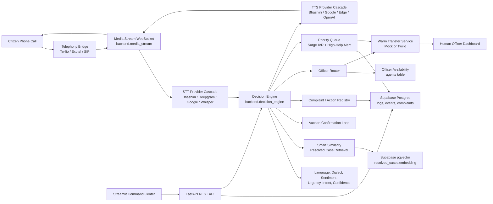
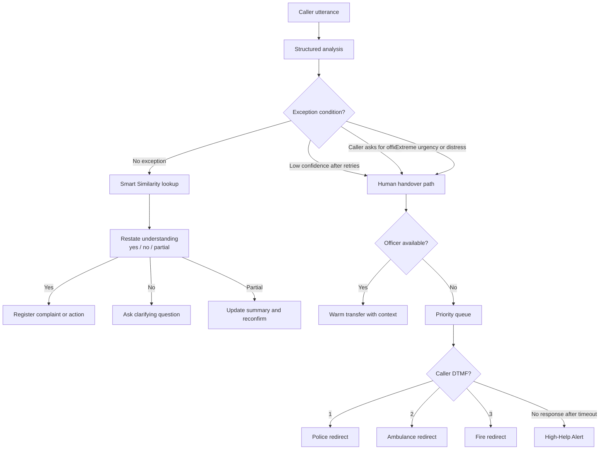
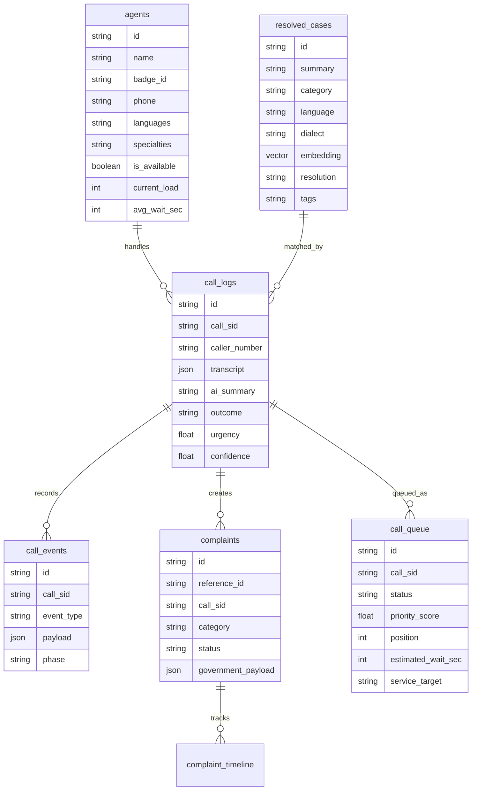
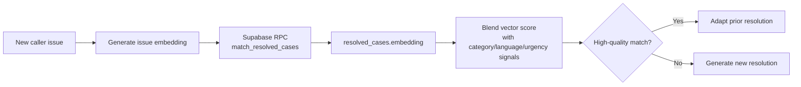

# Sahayak 1092

**Every Voice Heard. Every Call Resolved. Every Second Counts.**

Sahayak 1092 is an AI-first voice-to-voice helpline system for India's 1092 emergency support flow. It answers a citizen immediately, understands their language, dialect, intent, emotion, and urgency, resolves high-confidence calls autonomously, and hands over only true exceptions to the best available officer with full context.

The goal is simple: reduce caller wait time, reduce repeated explanations, protect frontline officers from routine overload, and keep the human team focused on cases where human judgement matters most.

## Table of Contents

- [Problem](#problem)
- [Solution](#solution)
- [Key Capabilities](#key-capabilities)
- [Architecture](#architecture)
- [Repository Structure](#repository-structure)
- [Setup](#setup)
- [Environment Variables](#environment-variables)
- [Supabase and Vector DB](#supabase-and-vector-db)
- [Run Locally](#run-locally)
- [Testing](#testing)
- [API Reference](#api-reference)
- [Demo Guide](#demo-guide)
- [Production Notes](#production-notes)

## Problem

When someone dials 1092, they usually need fast, accurate help. In the current human-first support pattern, even routine calls often go straight to an officer. That creates three serious problems:

- Citizens wait during urgent moments.
- Callers may need to repeat details because of language, dialect, or emotional mismatch.
- Officers spend time on repetitive cases instead of complex or high-distress cases.

Sahayak 1092 changes the default from human-first to AI-first, while still keeping human handover ready for genuine exceptions.

## Solution

Sahayak takes control from the first second of the call.

1. Citizen calls 1092.
2. Sahayak answers instantly in the detected language.
3. The caller speaks naturally.
4. Sahayak analyzes language, dialect, sentiment, urgency, intent, and confidence.
5. For high-confidence routine issues, Sahayak resolves the call end-to-end.
6. Before final action, Sahayak runs the Vachan confirmation loop so the citizen confirms the understanding.
7. If the case needs a human, Sahayak routes to the best available officer by urgency, language/dialect fit, and wait time.
8. During surge conditions, Sahayak places the caller in a priority queue, offers DTMF emergency redirects, and triggers a High-Help Alert if the caller becomes unresponsive.

## Key Capabilities

| Capability | What it does |
|---|---|
| AI-first call ownership | Resolves most high-confidence calls without default human transfer. |
| Multilingual analysis | Supports deterministic local analysis and provider-backed LLM analysis. |
| Smart Similarity Detection | Matches new issues against previously resolved cases using local embeddings or Supabase pgvector. |
| Vachan confirmation | Restates Sahayak's understanding and asks for yes/no/partial confirmation before final action. |
| Complaint registry | Creates structured complaint/action records with readable reference IDs. |
| Warm officer handover | Sends transcript, AI summary, sentiment, urgency, routing score, and first-sentence guidance to the officer. |
| Urgency-first routing | Scores officers using urgency/specialty, language/dialect fit, and wait/load signals. |
| Surge queue | Handles no-agent scenarios with priority queue position and estimated wait. |
| DTMF redirect | Supports "1 Police, 2 Ambulance, 3 Fire" while waiting in queue. |
| High-Help Alert | Auto-flags queued callers after timeout and routes toward police assistance. |
| Audit trail | Stores call events for analysis, similarity, Vachan, complaint, handover, queue, voice, and latency milestones. |
| Local demo mode | Runs without paid provider keys using deterministic fallbacks and local in-memory storage. |

## Architecture

### System Architecture

This is the main production shape of Sahayak 1092. Telephony, AI processing, routing, persistence, dashboard, and human handover are separated so the system can be tested locally and scaled in production.



### AI Decision Architecture

The decision engine uses deterministic safety rules before autonomous action. It does not blindly let an LLM decide emergency handover.



### Data Architecture

Supabase is the durable system of record. Local development can run without it, but production persistence and vector search need it.



### Runtime Modes

| Mode | Purpose | Storage | AI/Voice |
|---|---|---|---|
| Local demo | Fast development and judging walkthrough | In-memory fallback | Deterministic analyzer, local embedding fallback, TTS fallback |
| Integrated demo | Real dashboard plus durable records | Supabase and optional Redis | Configurable provider cascade |
| Phone demo | Real Twilio call | Supabase recommended | Twilio Media Stream plus STT/TTS providers |
| Production target | Government-ready deployment shape | Supabase/Postgres, Redis, observability | Bhashini-first voice, audited AI decisions, warm transfer |

## Repository Structure

```text
.
|-- backend/
|   |-- app.py                       # ASGI entrypoint for deployment
|   |-- main.py                      # FastAPI app, Twilio webhooks, REST API
|   |-- config.py                    # Typed environment settings
|   |-- decision_engine.py           # Main AI-first decision pipeline
|   |-- media_stream.py              # Twilio WebSocket voice loop
|   |-- vector_admin.py              # Seed/backfill vector cases
|   |-- intelligence/
|   |   |-- analyzer.py              # Deterministic and LLM analyzers
|   |   |-- embeddings.py            # Deterministic/OpenAI embedding providers
|   |   |-- safety_rules.py          # Handover policy
|   |   |-- schemas.py               # Shared domain models
|   |   `-- similarity.py            # Smart Similarity retrieval
|   |-- persistence/
|   |   |-- complaints.py            # Complaint/action registry
|   |   |-- models.sql               # Supabase schema
|   |   |-- pii.py                   # PII helpers
|   |   `-- repository.py            # Call state, events, logs
|   |-- routing/
|   |   |-- officer_router.py        # Urgency/language/wait scoring
|   |   |-- queue_manager.py         # Priority queue and High-Help Alert
|   |   `-- transfer_service.py      # Mock/Twilio warm transfer
|   `-- voice/
|       |-- audio_codec.py           # mu-law/PCM helpers
|       |-- stt.py                   # STT provider cascade
|       |-- tts.py                   # TTS provider cascade and phrase cache
|       `-- vad.py                   # Voice activity detection
|-- dashboard/
|   `-- app.py                       # Streamlit command center
|-- tests/                           # Regression tests
|-- Makefile                         # Common developer commands
|-- ROADMAP.md                       # Phase-wise build plan
|-- IMPLEMENTATION_PLAN.txt          # Original project idea and plan
|-- requirements.txt
`-- .env.example
```

## Setup

### Prerequisites

- Python 3.11 or newer
- A terminal with `make`
- Optional: Supabase project for durable DB and vector search
- Optional: Twilio account and ngrok for real phone calls
- Optional: provider keys for Bhashini, Deepgram, Gemini, OpenAI

### Install Dependencies

```bash
python -m venv .venv
source .venv/bin/activate
.venv/bin/python -m pip install --prefer-binary -r requirements.txt
```

On Windows:

```bash
python -m venv .venv
.venv\Scripts\activate
.venv\Scripts\python -m pip install --prefer-binary -r requirements.txt
```

### Create `.env`

```bash
cp .env.example .env
```

For local development, blank provider keys are allowed. Sahayak will use deterministic and local fallbacks where possible.

## Environment Variables

### Minimum Local Demo

```env
SAHAYAK_ENV=development
DEBUG=true
DEMO_MODE=true
BASE_URL=http://localhost:8000
SAHAYAK_API_URL=http://localhost:8000

ANALYSIS_PROVIDER=deterministic
EMBEDDING_PROVIDER=deterministic
TRANSFER_MODE=mock
```

### AI and Voice Providers

| Variable | Used for |
|---|---|
| `OPENAI_API_KEY` | LLM analysis, response generation, embeddings, Whisper/TTS fallback |
| `OPENAI_BASE_URL` | OpenAI-compatible provider endpoint |
| `LLM_MODEL` | Main LLM model name |
| `BHASHINI_API_KEY` | Indian-language STT/TTS provider |
| `BHASHINI_USER_ID` | Bhashini user identifier |
| `DEEPGRAM_API_KEY` | STT fallback |
| `GEMINI_API_KEY` | Google/Gemini fallback path |
| `STT_PROVIDER_ORDER` | Ordered STT provider cascade |
| `TTS_PROVIDER_ORDER` | Ordered TTS provider cascade |
| `VOICE_PROVIDER_TIMEOUT_SEC` | Per-provider voice timeout |
| `TTS_PHRASE_CACHE_ENABLED` | Cache common spoken phrases after first synthesis |

### Telephony

| Variable | Used for |
|---|---|
| `TWILIO_ACCOUNT_SID` | Twilio REST client |
| `TWILIO_AUTH_TOKEN` | Twilio REST client |
| `TWILIO_PHONE_NUMBER` | Incoming/outbound Twilio number |
| `BASE_URL` | Public backend URL used by Twilio webhooks |
| `TRANSFER_MODE` | `mock` for local demo, `twilio` for real transfer mode |

### Persistence and Similarity

| Variable | Used for |
|---|---|
| `SUPABASE_URL` | Supabase project URL |
| `SUPABASE_KEY` | Supabase API key |
| `REDIS_URL` | Optional live call state store |
| `EMBEDDING_PROVIDER` | `deterministic`, `openai`, or `auto` |
| `EMBEDDING_MODEL` | Embedding model name |
| `EMBEDDING_DIMENSION` | Vector dimension, default `1536` |
| `VECTOR_SEARCH_LIMIT` | Candidate count for vector search |
| `VECTOR_DB_MATCH_THRESHOLD` | DB-side cosine similarity threshold |
| `SIMILARITY_MATCH_THRESHOLD` | Final blended similarity threshold |

### Decision and Queue Settings

| Variable | Default | Used for |
|---|---:|---|
| `LOW_CONFIDENCE_THRESHOLD` | `0.5` | Retry/handover threshold |
| `LOW_CONFIDENCE_MAX_ATTEMPTS` | `2` | Max low-confidence attempts before human handover |
| `AUTONOMOUS_CONFIDENCE_THRESHOLD` | `0.7` | Minimum confidence for autonomous progress |
| `EXTREME_URGENCY_THRESHOLD` | `0.9` | Urgency threshold for immediate human path |
| `HIGH_HELP_ALERT_TIMEOUT_SEC` | `120` | Production queue timeout |
| `HIGH_HELP_ALERT_DEMO_TIMEOUT_SEC` | `20` | Short demo-mode queue timeout |

## Supabase and Vector DB

Supabase is used for durable persistence. The vector DB is Supabase Postgres with the `pgvector` extension.

### What Supabase Stores

| Table | Purpose |
|---|---|
| `agents` | Officer profile, languages, specialties, availability, wait/load |
| `resolved_cases` | Knowledge base of handled cases and their embeddings |
| `call_logs` | Call-level record, transcript, summary, outcome, handover/queue fields |
| `call_events` | Immutable audit events for every major decision |
| `complaints` | Structured citizen complaint/action records |
| `complaint_timeline` | Timeline of complaint and government-payload events |
| `call_queue` | Durable surge queue entries, priority score, status, High-Help Alert data |

### How Vector Search Works



The vector DB is used inside Smart Similarity Detection:

- `backend/intelligence/embeddings.py` generates embeddings.
- `backend/intelligence/similarity.py` queries similar resolved cases.
- `backend/persistence/models.sql` defines `resolved_cases.embedding` and `match_resolved_cases(...)`.
- `backend/vector_admin.py` seeds and backfills vector data.

Local development can use deterministic embeddings. Production should use provider embeddings with stable dimensions.

### Create Supabase Schema

1. Create a Supabase project.
2. Open the Supabase SQL Editor.
3. Run all SQL from:

```text
backend/persistence/models.sql
```

4. Add credentials to `.env`:

```env
SUPABASE_URL=https://your-project.supabase.co
SUPABASE_KEY=your_supabase_key
```

5. For production vector search, configure embeddings:

```env
EMBEDDING_PROVIDER=openai
OPENAI_API_KEY=your_key
EMBEDDING_MODEL=text-embedding-3-small
EMBEDDING_DIMENSION=1536
```

6. Seed and backfill demo cases:

```bash
make PYTHON=.venv/bin/python seed-vector-cases
make PYTHON=.venv/bin/python backfill-vector-embeddings
```

## Run Locally

### Backend

```bash
make PYTHON=.venv/bin/python dev-backend
```

Backend URLs:

```text
API:    http://localhost:8000
Health: http://localhost:8000/health
Docs:   http://localhost:8000/docs
```

### Dashboard

```bash
make PYTHON=.venv/bin/python dev-dashboard
```

Dashboard URL:

```text
http://localhost:8501
```

## Testing

Run the full verification suite:

```bash
make PYTHON=.venv/bin/python smoke
.venv/bin/python -m ruff check backend dashboard tests
```

Or run directly:

```bash
.venv/bin/python -m compileall backend dashboard tests
.venv/bin/python -m pytest -q
```

Current verified result:

```text
42 passed
```

### Text-Only Pipeline Test

Use this before trying a real phone call:

```bash
curl -X POST http://localhost:8000/api/test-pipeline \
  -H "Content-Type: application/json" \
  -d '{"call_sid":"demo-mobile-1","text":"My mobile phone was stolen at Majestic bus stand","language":"english"}'
```

Then confirm Vachan using the same `call_sid`:

```bash
curl -X POST http://localhost:8000/api/test-pipeline \
  -H "Content-Type: application/json" \
  -d '{"call_sid":"demo-mobile-1","text":"yes","language":"english"}'
```

Check created complaints:

```bash
curl http://localhost:8000/api/complaints
```

Check audit events:

```bash
curl "http://localhost:8000/api/call-events?call_sid=demo-mobile-1&limit=50"
```

### Queue and Surge Test

To show the no-agent surge behavior:

1. Set all dashboard agents unavailable, or use an empty `agents` table.
2. Trigger a human-request or high-urgency call through `/api/test-pipeline`.
3. Check queue state:

```bash
curl http://localhost:8000/api/queue
```

4. Open the dashboard Queue page to see position, wait, priority, and High-Help Alert status.

## Live Phone Call

Manual telephony setup is required.

1. Start backend:

```bash
make PYTHON=.venv/bin/python dev-backend
```

2. Start a public tunnel:

```bash
ngrok http 8000
```

3. Set `.env`:

```env
BASE_URL=https://your-ngrok-url.ngrok-free.app
TWILIO_ACCOUNT_SID=your_sid
TWILIO_AUTH_TOKEN=your_token
TWILIO_PHONE_NUMBER=your_twilio_number
```

4. Restart backend.
5. In Twilio Console, set the voice webhook:

```text
POST {BASE_URL}/twilio/incoming
```

6. Call the Twilio number, or ask Sahayak to call your phone:

```bash
curl -X POST http://localhost:8000/api/call-me \
  -H "Content-Type: application/json" \
  -d '{"phone":"+91XXXXXXXXXX"}'
```

Twilio should connect to:

```text
wss://<ngrok-host>/twilio/media-stream
```

## API Reference

| Method | Endpoint | Purpose |
|---|---|---|
| `POST` | `/twilio/incoming` | Incoming Twilio voice webhook |
| `POST` | `/twilio/status` | Twilio call status callback |
| `WS` | `/twilio/media-stream` | Bidirectional audio WebSocket |
| `POST` | `/api/call-me` | Start outbound call to a phone number |
| `POST` | `/api/test-pipeline` | Text-only pipeline test |
| `GET` | `/api/active-calls` | Live active calls for dashboard |
| `GET` | `/api/call-logs` | Recent call logs |
| `GET` | `/api/call-transcript/{call_sid}` | Transcript for one call |
| `GET` | `/api/call-events` | Audit events, optionally filtered by `call_sid` |
| `GET` | `/api/agents` | Officer list |
| `POST` | `/api/agent/toggle` | Toggle officer availability |
| `POST` | `/api/handover/{call_sid}/accept` | Officer accepts a warm handover |
| `GET` | `/api/queue` | Priority queue entries |
| `GET` | `/api/queue/{call_sid}` | One queue entry |
| `GET` | `/api/complaints` | Structured complaints/actions |
| `GET` | `/api/complaints/{reference_id}/timeline` | Complaint timeline |
| `GET` | `/api/resolved-cases` | Resolved case knowledge base |
| `GET` | `/health` | Service health |

## Demo Guide

For a stable competition demo, use this order:

1. Open `/health` and show service readiness.
2. Open the Streamlit dashboard.
3. Run a text pipeline call for a phone theft or waterlogging issue.
4. Show language, urgency, confidence, and AI summary.
5. Show Smart Similarity match and adapted resolution.
6. Show the Vachan confirmation prompt.
7. Send `yes` with the same `call_sid`.
8. Show generated complaint reference ID and complaint timeline.
9. Toggle officers unavailable and trigger a human-request call.
10. Show priority queue and High-Help Alert behavior.
11. Toggle an officer available and show warm handover context.
12. If Twilio is configured, repeat the story with a live phone call.

## Production Notes

Sahayak is built so development remains easy, while production concerns are explicit.

- Use `TRANSFER_MODE=mock` for local demos and `TRANSFER_MODE=twilio` for real call transfer testing.
- Run `backend/persistence/models.sql` whenever Supabase schema changes.
- Keep `DEMO_MODE=true` for hackathon demos with shorter queue timeout.
- Use `DEMO_MODE=false` for production-like behavior.
- Store real secrets only in `.env` or your deployment secret manager.
- Use Supabase for durable records and pgvector retrieval.
- Use Redis when multiple backend workers need shared live call state.
- Review PII retention and masking rules before real deployment.

## Developer Commands

```bash
make PYTHON=.venv/bin/python install
make PYTHON=.venv/bin/python dev-backend
make PYTHON=.venv/bin/python dev-dashboard
make PYTHON=.venv/bin/python test
make PYTHON=.venv/bin/python lint
make PYTHON=.venv/bin/python format
make PYTHON=.venv/bin/python smoke
make PYTHON=.venv/bin/python seed-vector-cases
make PYTHON=.venv/bin/python backfill-vector-embeddings
```

## License

Built for AI for Bharat 2026, Theme 12: AI for 1092 Helpline.
