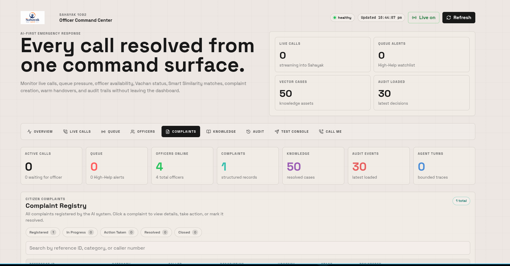
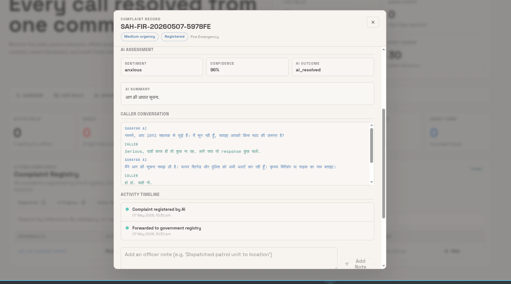
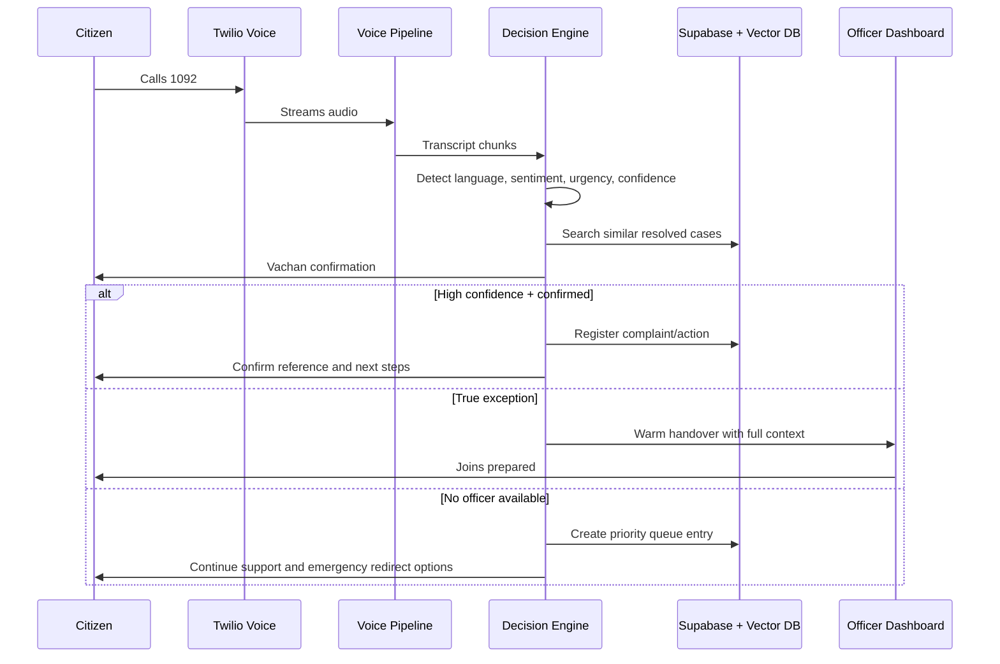
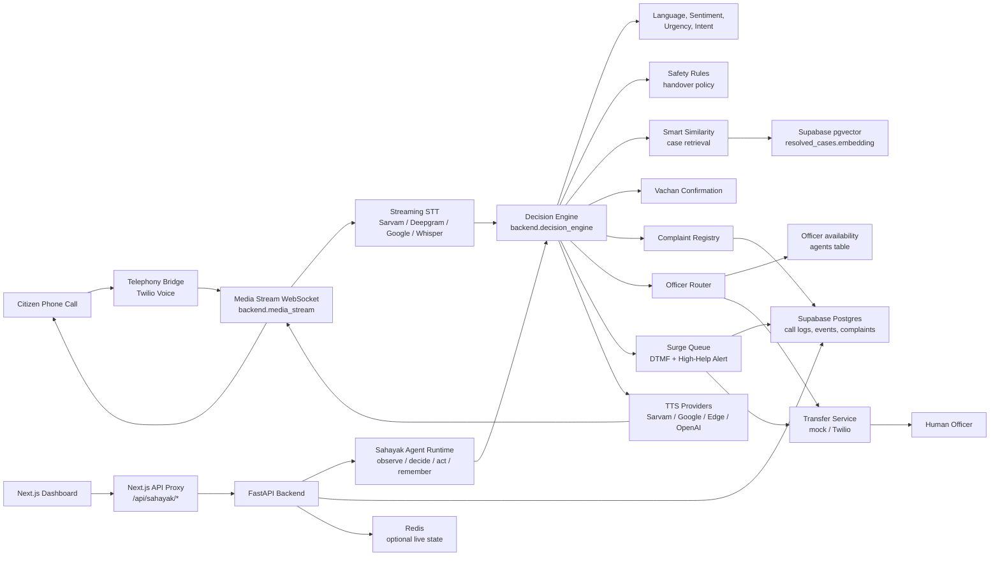
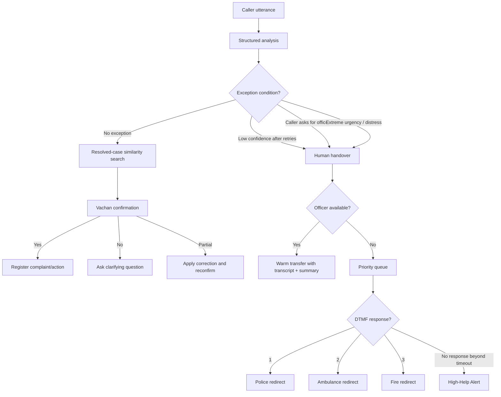
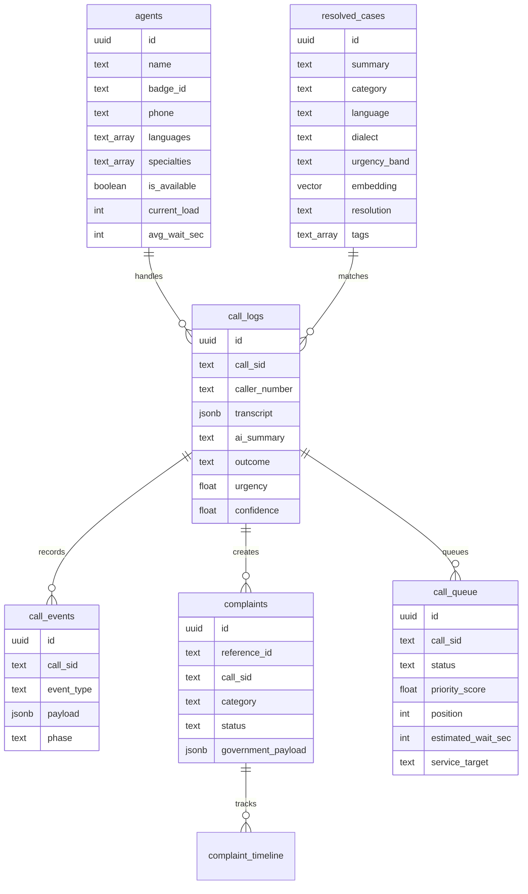
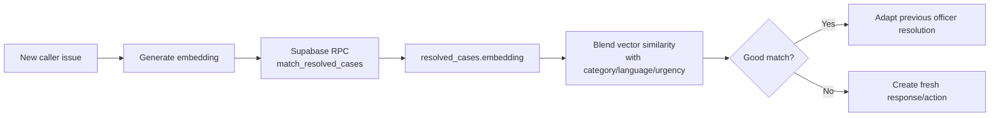

<div align="center">
  

  <h1>Sahayak 1092</h1>

  <p><strong>Every Voice Heard. Every Call Resolved. Every Second Counts.</strong></p>

  <p>
    AI-first emergency voice support for fast, multilingual 1092 assistance.
    Sahayak answers citizens, understands urgency, registers complaints, routes human exceptions,
    and gives officers a live command center.
  </p>

  <p>
    <a href="https://sahayak-1092.onrender.com"><strong>Live Backend</strong></a>
    ·
    <a href="https://sahayak-1092.onrender.com/health"><strong>Health Check</strong></a>
  </p>
</div>

## Tech Stack


## Live Links

| Service | Link |
|---|---|
| Backend API | https://sahayak-1092.onrender.com |
| Backend health | https://sahayak-1092.onrender.com/health |
| Dashboard app | Deploy the `dashboard/` app and point it to the backend URL above |

## Dashboard Preview

<table>
  <tr>
    <td></td>
  </tr>
  <tr>
    <td></td>
  </tr>
</table>

## Contents

- [Why This Exists](#why-this-exists)
- [What Sahayak Does](#what-sahayak-does)
- [Core Call Flow](#core-call-flow)
- [Architecture](#architecture)
- [Agent Runtime](#agent-runtime)
- [Decision Architecture](#decision-architecture)
- [Data Architecture](#data-architecture)
- [Project Structure](#project-structure)
- [Stack by Layer](#stack-by-layer)
- [Quick Start](#quick-start)
- [Environment Setup](#environment-setup)
- [Supabase and Vector DB](#supabase-and-vector-db)
- [Run the App](#run-the-app)
- [Testing](#testing)
- [Live Twilio Call Setup](#live-twilio-call-setup)
- [Dashboard](#dashboard)
- [API Reference](#api-reference)
- [Production Deployment](#production-deployment)
- [Developer Commands](#developer-commands)
- [Runtime Modes](#runtime-modes)
- [Security Notes](#security-notes)

## Why This Exists

When a citizen calls 1092, they need help quickly. Many helpline flows still send almost every call directly to a human officer, even when the issue is routine or has been resolved many times before. That creates four problems:

- Citizens wait during stressful or urgent moments.
- Callers repeat the same facts after every transfer.
- Language, dialect, and emotional speech can make triage harder.
- Officers lose time to repetitive calls instead of high-judgement cases.

Sahayak changes the operating model from human-first triage to AI-first support with human safety rails. The goal is not to replace officers. The goal is to protect their attention for calls where human judgement matters most.

## What Sahayak Does

| Capability | Description |
|---|---|
| Instant AI call ownership | Sahayak answers from the first second instead of waiting for a human queue. |
| Multilingual understanding | Detects and handles Kannada, Hindi, English, and Indian-language signals through configurable speech providers. |
| Emotion and urgency analysis | Classifies sentiment, distress, urgency, category, intent, and confidence. |
| Smart Similarity Detection | Matches new calls with previously resolved officer-handled cases using embeddings and vector search. |
| Vachan confirmation loop | Restates the understood issue and asks for yes, no, or partial correction before final action. |
| Autonomous complaint registration | Creates structured complaint records for high-confidence confirmed calls. |
| Human exception handover | Transfers low-confidence, human-requested, or extreme-distress calls to officers. |
| Urgency-first routing | Scores officers by urgency priority, language fit, specialty, wait time, and current load. |
| Warm transfer | Sends transcript, AI summary, sentiment, urgency, and correction context to the officer. |
| Surge queue | Keeps priority order when officers are busy and shows estimated wait in the dashboard. |
| Emergency redirect | Lets queued callers choose Police, Ambulance, or Fire Services. |
| High-Help Alert | Escalates callers who become unresponsive after the configured queue timeout. |
| Officer dashboard | Next.js command center for live calls, handovers, queue, complaints, and resolved-case learning. |
| Auditability | Stores call events, decisions, transcripts, corrections, queue events, and complaint timelines. |

## Core Call Flow



## Architecture

Sahayak is split into telephony, voice, intelligence, decisioning, routing, persistence, security, and dashboard layers. This keeps the project simple to run locally while still matching a production deployment shape.



## Agent Runtime

Sahayak is implemented as a bounded AI agent, not an unrestricted chatbot. The API, dashboard, and Twilio voice stream are channels into the same runtime:

```text
Channel input -> SahayakAgent -> approved tools -> decision result -> memory/audit trace
```

The runtime lives in `backend/agent/`.

| Agent layer | File | Purpose |
|---|---|---|
| Runtime | `backend/agent/sahayak_agent.py` | Single entrypoint for text, API, and voice turns. |
| Context | `backend/agent/context.py` | Agent input, tool, trace, and result schemas. |
| Tools | `backend/agent/tools.py` | Explicit tool registry and adapters to existing modules. |
| Policy | `backend/agent/policy.py` | Safety notes and policy explanation. |
| Memory | `backend/agent/memory.py` | Agent turn events and trace persistence. |
| Traces | `backend/agent/traces.py` | Human-readable observe, decide, act trace construction. |

The core workflow remains the same. The existing `decision_engine` performs the proven Sahayak logic, while the agent runtime wraps it so every turn has:

- a goal,
- a channel,
- observed input,
- approved tool calls,
- final action,
- final phase,
- safety notes,
- memory writes,
- an auditable trace.

Agent tools are intentionally bounded:

- `load_call_memory`
- `understand_caller`
- `evaluate_safety_policy`
- `search_resolved_cases`
- `request_vachan_confirmation`
- `register_complaint`
- `route_to_officer`
- `enqueue_priority_call`
- `respond_to_caller`

This is the right shape for an emergency/government system: the LLM can help interpret and respond, but deterministic policy and explicit tools control final action.

## Decision Architecture

Sahayak uses a rule-based plus ML/LLM hybrid design. Safety decisions are not left only to a generative model.



## Data Architecture



## Project Structure

```text
.
|-- backend/
|   |-- agent/                      # Bounded Sahayak agent runtime and traces
|   |-- api/                        # Health payload helpers
|   |-- intelligence/               # Analysis, embeddings, safety, similarity
|   |-- persistence/                # Complaints, call events, queue state, PII helpers
|   |-- routing/                    # Officer routing, queue manager, transfer service
|   |-- voice/                      # Audio codec, STT, TTS, VAD
|   |-- app.py                      # ASGI entrypoint: backend.app:app
|   |-- config.py                   # Typed environment settings
|   |-- decision_engine.py          # AI-first call decision pipeline
|   |-- main.py                     # FastAPI app, webhooks, REST API
|   |-- media_stream.py             # Twilio WebSocket voice loop
|   `-- vector_admin.py             # Seed and backfill vector cases
|-- dashboard/
|   |-- app/                        # Next.js App Router dashboard
|   |-- app/api/sahayak/[...path]/  # Server-side proxy to backend
|   |-- public/                     # Logo, background, dashboard screenshots
|   `-- package.json                # Dashboard commands and dependencies
|-- tests/                          # Regression test suite
|-- Makefile                        # Developer commands
|-- requirements.txt                # Python dependencies
|-- pyproject.toml                  # pytest and ruff config
`-- vercel.json                     # Vercel framework setting
```

## Stack by Layer

| Layer | Technology |
|---|---|
| Backend API | FastAPI, Uvicorn |
| Voice stream | Twilio Media Streams WebSocket |
| Telephony | Twilio Voice |
| STT | Sarvam AI, Deepgram, Google/Gemini, OpenAI Whisper-compatible path |
| TTS | Sarvam AI, Google/gTTS, Edge TTS, OpenAI-compatible path |
| LLM analysis | OpenAI-compatible client, Gemini-compatible base URL support, deterministic local analysis |
| Agent runtime | Bounded `SahayakAgent` with explicit tools, safety notes, memory, and traces |
| Embeddings | OpenAI-compatible embeddings or deterministic local embeddings |
| Database | Supabase Postgres |
| Vector DB | Supabase pgvector |
| Live state | Redis optional, local in-memory state for development |
| Dashboard | Next.js, React, TypeScript, Tailwind CSS, lucide-react |
| Testing | pytest, ruff, Next.js build/type checks |

## Quick Start

This path runs the project locally for backend and dashboard development.

### 1. Clone and enter the project

```bash
git clone <your-repo-url>
cd Sahayak-1092
```

### 2. Create Python environment

```bash
python -m venv .venv
source .venv/bin/activate
python -m pip install --prefer-binary -r requirements.txt
```

On Windows PowerShell:

```powershell
python -m venv .venv
.venv\Scripts\Activate.ps1
python -m pip install --prefer-binary -r requirements.txt
```

### 3. Install dashboard dependencies

```bash
npm --prefix dashboard install
```

### 4. Create backend env file

Create `.env` in the repository root:

```env
SAHAYAK_ENV=development
DEBUG=true
DEMO_MODE=true
HOST=0.0.0.0
PORT=8000
BASE_URL=http://localhost:8000
CORS_ORIGINS=http://localhost:3000

TWILIO_ACCOUNT_SID=
TWILIO_AUTH_TOKEN=
TWILIO_PHONE_NUMBER=
TRANSFER_MODE=mock

OPENAI_API_KEY=
OPENAI_BASE_URL=
LLM_MODEL=
ANALYSIS_PROVIDER=auto

SARVAM_API_KEY=
SARVAM_BASE_URL=https://api.sarvam.ai
DEEPGRAM_API_KEY=
STT_PROVIDER_ORDER=sarvam,deepgram,google,openai_whisper
TTS_PROVIDER_ORDER=sarvam,google,edge,openai
VOICE_PROVIDER_TIMEOUT_SEC=12
TTS_PHRASE_CACHE_ENABLED=true

SUPABASE_URL=
SUPABASE_SERVICE_ROLE_KEY=
REDIS_URL=

EMBEDDING_PROVIDER=deterministic
EMBEDDING_MODEL=text-embedding-3-small
EMBEDDING_DIMENSION=1536
VECTOR_SEARCH_LIMIT=10
VECTOR_DB_MATCH_THRESHOLD=0.15
SIMILARITY_MATCH_THRESHOLD=0.7

VALIDATE_TWILIO_SIGNATURES=false
DASHBOARD_AUTH_REQUIRED=false
DASHBOARD_API_KEY=
DASHBOARD_ADMIN_KEY=
DASHBOARD_READONLY_KEY=
RATE_LIMIT_ENABLED=true
MASK_PII_IN_LOGS=true
```

### 5. Create dashboard env file

Create `dashboard/.env.local`:

```env
SAHAYAK_API_URL=http://localhost:8000
NEXT_PUBLIC_SAHAYAK_API_URL=http://localhost:8000
SAHAYAK_DASHBOARD_API_KEY=
```

### 6. Start backend

```bash
uvicorn backend.app:app --host 0.0.0.0 --port 8000 --reload
```

Backend URLs:

```text
API:    http://localhost:8000
Health: http://localhost:8000/health
```

### 7. Start dashboard

Open a second terminal:

```bash
npm --prefix dashboard run dev
```

Dashboard URL:

```text
http://localhost:3000/dashboard
```

### 8. Run a text-only pipeline call

```bash
curl -X POST http://localhost:8000/api/test-pipeline \
  -H "Content-Type: application/json" \
  -d '{"call_sid":"demo-mobile-1","text":"My mobile phone was stolen at Majestic bus stand","language":"english"}'
```

Then confirm the Vachan loop:

```bash
curl -X POST http://localhost:8000/api/test-pipeline \
  -H "Content-Type: application/json" \
  -d '{"call_sid":"demo-mobile-1","text":"yes","language":"english"}'
```

Check the result in the dashboard, or call:

```bash
curl http://localhost:8000/api/complaints
curl "http://localhost:8000/api/call-events?call_sid=demo-mobile-1&limit=50"
```

## Environment Setup

Never commit `.env`, `dashboard/.env.local`, or real keys. They are ignored by git.

### Backend `.env`

The most important environment groups are:

#### App Runtime

```env
SAHAYAK_ENV=development
DEBUG=true
DEMO_MODE=true
HOST=0.0.0.0
PORT=8000
BASE_URL=http://localhost:8000
CORS_ORIGINS=http://localhost:3000
```

`BASE_URL` must be public when Twilio is calling your backend. For local phone testing, use a public HTTPS tunnel URL.

#### Dashboard Connection

```env
DASHBOARD_AUTH_REQUIRED=false
DASHBOARD_API_KEY=
DASHBOARD_ADMIN_KEY=
DASHBOARD_READONLY_KEY=
```

For the Next.js dashboard, set `SAHAYAK_DASHBOARD_API_KEY` in `dashboard/.env.local`. The dashboard proxy sends it to the backend as `X-Sahayak-API-Key`.

#### Telephony

```env
TWILIO_ACCOUNT_SID=
TWILIO_AUTH_TOKEN=
TWILIO_PHONE_NUMBER=
TRANSFER_MODE=mock
VALIDATE_TWILIO_SIGNATURES=false
```

Use `TRANSFER_MODE=mock` for local transfer testing. Use `TRANSFER_MODE=twilio` for real warm transfer testing.

#### AI and Voice Providers

```env
OPENAI_API_KEY=
OPENAI_BASE_URL=
LLM_MODEL=gpt-4o
LLM_PROVIDER_TIMEOUT_SEC=8
ANALYSIS_PROVIDER=auto

SARVAM_API_KEY=
SARVAM_BASE_URL=https://api.sarvam.ai
SARVAM_STT_MODEL=saaras:v3
SARVAM_STT_MODE=transcribe
SARVAM_TTS_MODEL=bulbul:v3
SARVAM_TTS_SPEAKER=shubh
SARVAM_TTS_PACE=0.95
SARVAM_TTS_TEMPERATURE=0.35

DEEPGRAM_API_KEY=
GEMINI_API_KEY=
STT_PROVIDER_ORDER=sarvam,deepgram,google,openai_whisper
TTS_PROVIDER_ORDER=sarvam,google,edge,openai
VOICE_PROVIDER_TIMEOUT_SEC=12
TTS_PHRASE_CACHE_ENABLED=true
```

If you use Gemini through an OpenAI-compatible endpoint, set:

```env
OPENAI_API_KEY=your_gemini_key
OPENAI_BASE_URL=https://generativelanguage.googleapis.com/v1beta/openai/
LLM_MODEL=gemini-1.5-flash
```

#### Persistence and Vector Search

```env
SUPABASE_URL=
SUPABASE_SERVICE_ROLE_KEY=
REDIS_URL=

EMBEDDING_PROVIDER=deterministic
EMBEDDING_MODEL=text-embedding-3-small
EMBEDDING_DIMENSION=1536
VECTOR_SEARCH_LIMIT=10
VECTOR_DB_MATCH_THRESHOLD=0.15
SIMILARITY_MATCH_THRESHOLD=0.7
```

For production vector search, use provider-backed embeddings:

```env
EMBEDDING_PROVIDER=openai
OPENAI_API_KEY=your_embedding_provider_key
EMBEDDING_MODEL=text-embedding-3-small
EMBEDDING_DIMENSION=1536
```

#### Security

```env
VALIDATE_TWILIO_SIGNATURES=true
DASHBOARD_AUTH_REQUIRED=true
DASHBOARD_API_KEY=generate-a-long-random-secret
DASHBOARD_ADMIN_KEY=
DASHBOARD_READONLY_KEY=
RATE_LIMIT_ENABLED=true
RATE_LIMIT_PER_MINUTE=180
MUTATION_RATE_LIMIT_PER_MINUTE=60
REQUEST_ID_HEADER=X-Request-ID
MASK_PII_IN_LOGS=true
DATA_RETENTION_DAYS=180
```

### Dashboard `dashboard/.env.local`

```env
SAHAYAK_API_URL=http://localhost:8000
NEXT_PUBLIC_SAHAYAK_API_URL=http://localhost:8000
SAHAYAK_DASHBOARD_API_KEY=
```

When backend auth is enabled, set:

```env
SAHAYAK_DASHBOARD_API_KEY=same-value-as-backend-DASHBOARD_API_KEY
```

## Supabase and Vector DB

Supabase is the durable system of record. The vector database is Supabase Postgres with the `pgvector` extension.

Local development can run without Supabase because the backend can keep local in-memory state. For a realistic deployment, configure Supabase.

### What Supabase Stores

| Table | Purpose |
|---|---|
| `agents` | Officer profile, languages, specialties, availability, wait/load |
| `resolved_cases` | Human-resolved case knowledge base with embeddings |
| `call_logs` | Call-level summary, transcript, outcome, similarity, queue/handover state |
| `call_events` | Immutable event/audit log for decisions and actions |
| `complaints` | Structured complaint/action records |
| `complaint_timeline` | Timeline for each complaint reference |
| `call_queue` | Priority queue, emergency redirect, and High-Help Alert data |

### Create the Schema

1. Create a Supabase project.
2. Open Supabase SQL Editor.
3. Run the SQL from `backend/persistence/models.sql`.
4. Add backend credentials:

```env
SUPABASE_URL=https://your-project.supabase.co
SUPABASE_SERVICE_ROLE_KEY=your-backend-service-role-key
```

Use the service-role key only on the FastAPI backend. If Row Level Security is enabled, anon keys can be rejected for inserts into tables such as `call_logs`, `call_events`, and `complaints`.

5. Verify database read/write access:

```bash
make PYTHON=.venv/bin/python diagnose-supabase
```

6. Seed resolved cases:

```bash
make PYTHON=.venv/bin/python seed-vector-cases
```

The seeded resolved-case dataset lives in `backend/intelligence/seed_cases.py`. It covers theft, cyber fraud, domestic safety, suspicious activity, missing people, accidents, fire, medical, harassment, and civic-support cases across English, Hindi, and Kannada.

7. Backfill embeddings:

```bash
make PYTHON=.venv/bin/python backfill-vector-embeddings
```

### How Smart Similarity Uses Vector DB



The implementation lives in:

- `backend/intelligence/embeddings.py`
- `backend/intelligence/similarity.py`
- `backend/persistence/models.sql`
- `backend/vector_admin.py`

## Run the App

### Backend

```bash
make PYTHON=.venv/bin/python dev-backend
```

Direct command:

```bash
uvicorn backend.app:app --host 0.0.0.0 --port 8000 --reload
```

### Next.js Dashboard

```bash
make dev-dashboard
```

Direct command:

```bash
npm --prefix dashboard run dev -- --hostname 127.0.0.1 --port 3000
```

## Testing

Run backend tests:

```bash
pytest
```

Run lint/type checks:

```bash
ruff check .
npm --prefix dashboard run typecheck
```

Run the dashboard production build:

```bash
npm --prefix dashboard run build
```

Run a dependency audit for dashboard production dependencies:

```bash
npm --prefix dashboard audit --omit=dev
```

## Live Twilio Call Setup

Use this only after the text-only pipeline works.

### 1. Start backend

```bash
uvicorn backend.app:app --host 0.0.0.0 --port 8000 --reload
```

### 2. Start a public tunnel

```bash
ngrok http 8000
```

### 3. Update backend `.env`

```env
BASE_URL=https://your-ngrok-domain.ngrok-free.app
TWILIO_ACCOUNT_SID=your_twilio_sid
TWILIO_AUTH_TOKEN=your_twilio_auth_token
TWILIO_PHONE_NUMBER=your_twilio_number
TRANSFER_MODE=twilio
VALIDATE_TWILIO_SIGNATURES=true
```

### 4. Configure Twilio Voice Webhook

In Twilio Console, set the phone number voice webhook:

```text
POST https://your-ngrok-domain.ngrok-free.app/twilio/incoming
```

The backend returns TwiML that connects the call to:

```text
wss://your-ngrok-domain.ngrok-free.app/twilio/media-stream
```

### 5. Optional outbound call test

```bash
curl -X POST http://localhost:8000/api/call-me \
  -H "Content-Type: application/json" \
  -d '{"phone":"+91XXXXXXXXXX"}'
```

## Dashboard

The main dashboard is a Next.js app in `dashboard/app`. It is designed as an officer command center, not a static UI.

It supports:

- Live call monitoring.
- Active transcript and AI summary.
- Language, sentiment, urgency, confidence, and outcome cards.
- Officer availability controls.
- Warm handover acceptance.
- Complaint and timeline visibility.
- Priority queue monitoring.
- High-Help Alert visibility.
- Resolved-case learning from corrected calls.
- Test console for the backend decision pipeline.
- Outbound call trigger through Twilio.

The dashboard calls the backend through the server-side route:

```text
dashboard/app/api/sahayak/[...path]/route.ts
```

This keeps the backend API key server-side instead of exposing it to the browser.

## API Reference

| Method | Endpoint | Purpose |
|---|---|---|
| `POST` | `/twilio/incoming` | Incoming Twilio voice webhook |
| `POST` | `/twilio/status` | Twilio call status callback |
| `WS` | `/twilio/media-stream` | Bidirectional Twilio audio WebSocket |
| `POST` | `/api/call-me` | Start outbound call to a phone number |
| `POST` | `/api/test-pipeline` | Text-only AI pipeline test |
| `GET` | `/api/active-calls` | Active calls for dashboard |
| `GET` | `/api/call-logs` | Recent call logs |
| `GET` | `/api/call-transcript/{call_sid}` | Transcript for one call |
| `GET` | `/api/call-events` | Audit events, optionally filtered by `call_sid` |
| `GET` | `/api/agents` | Officer list |
| `GET` | `/api/agent/tools` | Bounded Sahayak agent tool registry |
| `GET` | `/api/agent/traces` | Recent agent turn traces, optionally filtered by `call_sid` |
| `POST` | `/api/agent/toggle` | Toggle officer availability |
| `POST` | `/api/calls/{call_sid}/corrections` | Store officer correction as audit event |
| `POST` | `/api/handover/{call_sid}/accept` | Officer accepts warm handover |
| `GET` | `/api/complaints` | Structured complaints/actions |
| `GET` | `/api/complaints/{reference_id}/timeline` | Complaint timeline |
| `PATCH` | `/api/complaints/{reference_id}` | Update complaint status and metadata |
| `POST` | `/api/complaints/{reference_id}/notes` | Add complaint timeline notes |
| `GET` | `/api/resolved-cases` | Resolved case knowledge base |
| `POST` | `/api/resolved-cases/from-call` | Add corrected call resolution to knowledge base |
| `GET` | `/api/queue` | Priority queue entries |
| `GET` | `/api/queue/{call_sid}` | One queue entry |
| `GET` | `/health` | Health and readiness metadata |
| `GET` | `/` | Basic service metadata |

When `DASHBOARD_AUTH_REQUIRED=true`, protected `/api/*` requests require:

```text
X-Sahayak-API-Key: <DASHBOARD_API_KEY>
```

The Next.js dashboard proxy sends this automatically when `SAHAYAK_DASHBOARD_API_KEY` is configured.

## Production Deployment

### Backend on Render

Use these settings for the backend service:

| Setting | Value |
|---|---|
| Root directory | Leave blank |
| Environment | Python |
| Build command | `pip install --prefer-binary -r requirements.txt` |
| Start command | `uvicorn backend.app:app --host 0.0.0.0 --port $PORT` |

The root directory stays blank because the backend package and `requirements.txt` are both resolved from the repository root.

Minimum production backend env:

```env
SAHAYAK_ENV=production
DEBUG=false
DEMO_MODE=false
HOST=0.0.0.0
PORT=8000
BASE_URL=https://sahayak-1092.onrender.com
CORS_ORIGINS=https://your-dashboard-domain.com

SUPABASE_URL=https://your-project.supabase.co
SUPABASE_SERVICE_ROLE_KEY=your-backend-service-role-key
REDIS_URL=your-redis-url

TWILIO_ACCOUNT_SID=your_twilio_sid
TWILIO_AUTH_TOKEN=your_twilio_auth_token
TWILIO_PHONE_NUMBER=your_twilio_number
TRANSFER_MODE=twilio

VALIDATE_TWILIO_SIGNATURES=true
DASHBOARD_AUTH_REQUIRED=true
DASHBOARD_API_KEY=your-long-random-dashboard-key
RATE_LIMIT_ENABLED=true
MASK_PII_IN_LOGS=true

ANALYSIS_PROVIDER=auto
OPENAI_API_KEY=your-openai-or-openai-compatible-key
OPENAI_BASE_URL=
LLM_MODEL=gpt-4o

EMBEDDING_PROVIDER=openai
EMBEDDING_MODEL=text-embedding-3-small
EMBEDDING_DIMENSION=1536

SARVAM_API_KEY=your_sarvam_key
SARVAM_STT_MODEL=saaras:v3
SARVAM_TTS_MODEL=bulbul:v3
DEEPGRAM_API_KEY=your_deepgram_key
```

### Dashboard on Vercel

Deploy the `dashboard/` app as the Next.js frontend. Set the dashboard environment values to the deployed backend:

```env
SAHAYAK_API_URL=https://sahayak-1092.onrender.com
NEXT_PUBLIC_SAHAYAK_API_URL=https://sahayak-1092.onrender.com
SAHAYAK_DASHBOARD_API_KEY=same-value-as-backend-DASHBOARD_API_KEY
```

Build commands:

```bash
npm --prefix dashboard install
npm --prefix dashboard run build
```

Start command:

```bash
npm --prefix dashboard run start
```

### Deployment Checklist

- Supabase schema is applied from `backend/persistence/models.sql`.
- `resolved_cases` has seeded cases and embeddings.
- `BASE_URL` is the public backend HTTPS URL.
- Twilio webhook points to `{BASE_URL}/twilio/incoming`.
- `VALIDATE_TWILIO_SIGNATURES=true` for public Twilio use.
- Dashboard and backend share the dashboard API key.
- `CORS_ORIGINS` is restricted to the real dashboard domain.
- Redis is configured if running multiple backend workers.
- Real secrets are stored in the deployment secret manager.

## Developer Commands

```bash
make PYTHON=.venv/bin/python install
make install-dashboard
make PYTHON=.venv/bin/python dev-backend
make dev-dashboard
make PYTHON=.venv/bin/python test
make PYTHON=.venv/bin/python lint
make PYTHON=.venv/bin/python format
make PYTHON=.venv/bin/python smoke
make PYTHON=.venv/bin/python seed-vector-cases
make PYTHON=.venv/bin/python backfill-vector-embeddings
make clean
```

## Runtime Modes

| Mode | Use case | Key settings |
|---|---|---|
| Local development | Fast local backend/dashboard work | `DEMO_MODE=true`, `TRANSFER_MODE=mock`, local state allowed |
| Integrated demo | Real dashboard and Supabase records | Supabase configured, optional provider keys |
| Phone demo | Twilio call flow | Twilio keys, `BASE_URL` public, media stream enabled |
| Production target | Real deployment shape | `DEMO_MODE=false`, auth/signature validation enabled, Supabase, Redis, provider keys |

## Security Notes

- `.env` and `dashboard/.env.local` must never be committed.
- Rotate any key that has ever been pasted into chat, screenshots, or public commits.
- Protect backend access with `DASHBOARD_API_KEY` and dashboard UI access with `SAHAYAK_DASHBOARD_API_KEY`.
- Keep `MASK_PII_IN_LOGS=true`.
- Keep `VALIDATE_TWILIO_SIGNATURES=true` for public Twilio webhooks.
- Keep `DASHBOARD_AUTH_REQUIRED=true` outside local development.
- Use the Next.js proxy route instead of exposing backend keys to the browser.
- Use Supabase RLS/service-role policy carefully before real citizen data.
- Review data retention rules before any real-world pilot.

## License

Built for AI for Bharat 2026, Theme 12: AI for 1092 Helpline.
